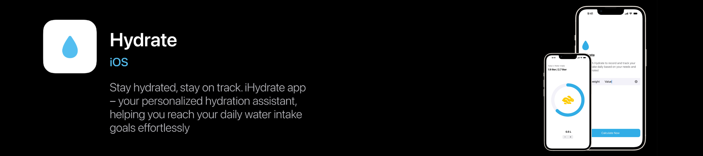
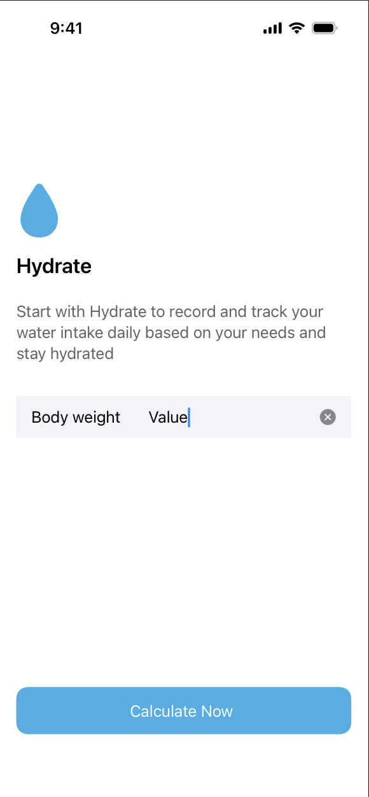
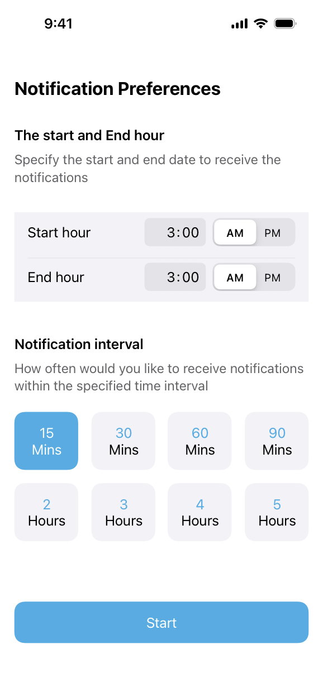
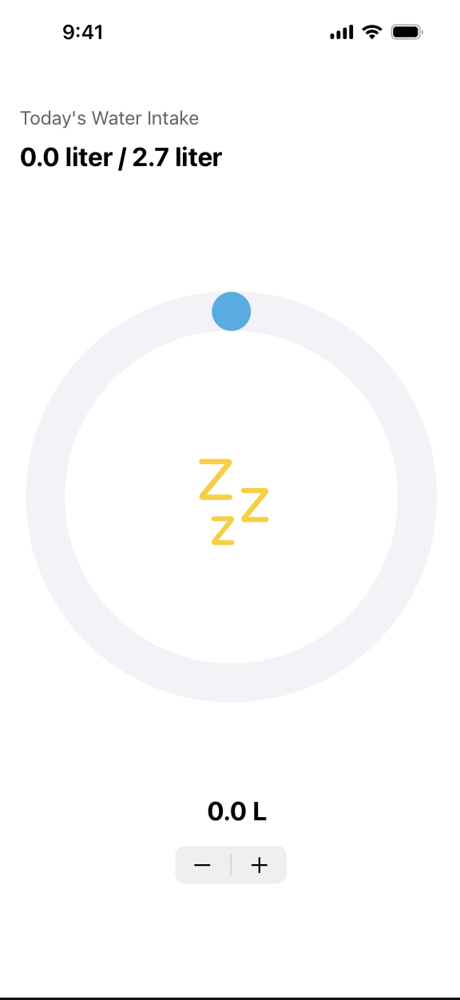
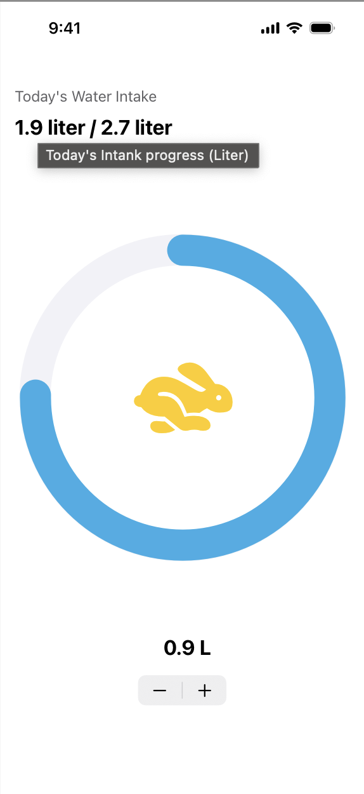

# Hydrate 💧

**Hydrate** is a personalized hydration assistant app that helps you stay on track with your daily water intake goals.  

This app is designed to make tracking your hydration effortless, allowing you to set your goals and receive reminders to help you meet them throughout the day.

> **Note:** The app is still under development and will receive updates soon.🚧 Usage of the app is prohibited for profit-related reasons, and it cannot be downloaded from the App Store.

## Features🌟

- **Daily Hydration Goals:** Set and track your personalized water intake goals.

- **Reminders:** Receive timely notifications to remind you to drink water and stay hydrated.

- **Progress Tracking:** Visualize your hydration progress and see how close you are to reaching your goal.

## App Storage Integration 🗄️

The project is currently working with **AppStorage** to manage user settings and data.

## Installation

1. Clone the repository to your local machine.💻

2. Open the project in Xcode.🛠️

3. Build and run the app on your preferred iOS simulator or device.📱

## Usage

1. Set your daily water intake goal in the app.💦

2. Enable notifications to receive reminders throughout the day.⏳

3. Track your water intake progress on the main screen.📉

## Known Issues ⚠️

- **Notification Feature:** Currently, the notification feature is not functioning as expected and is under development.🛠️💡

## Screenshots 📸

Here are some screenshots of the **Hydrate** app in action:

    
    
    
    

## Contributing🤝

Feel free to contribute to the development of Hydrate by reporting issues, suggesting new features, or submitting pull requests.

For inquiries, you can reach out via email at **raghadmohammed553@gmail.com** 📬.
